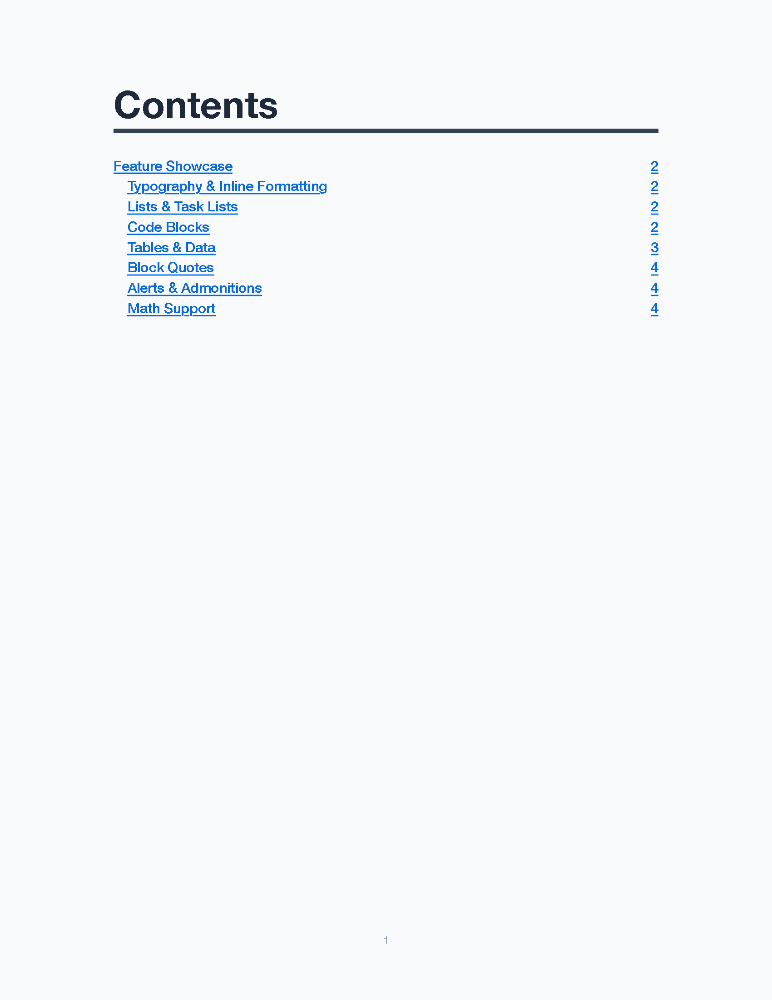
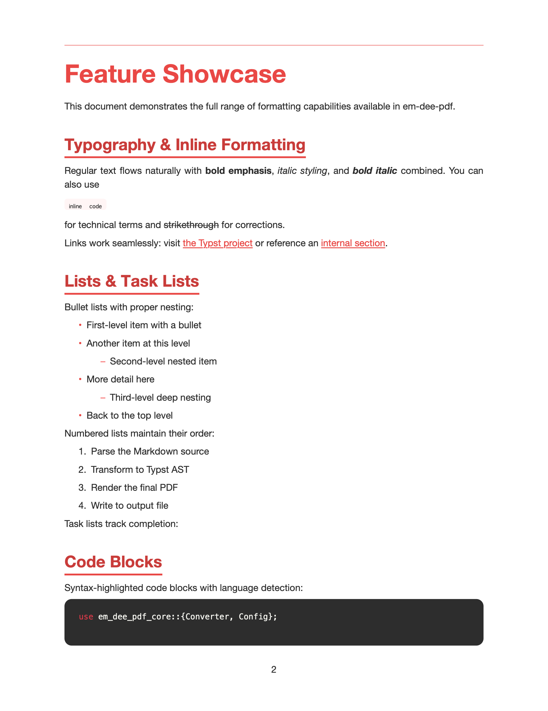
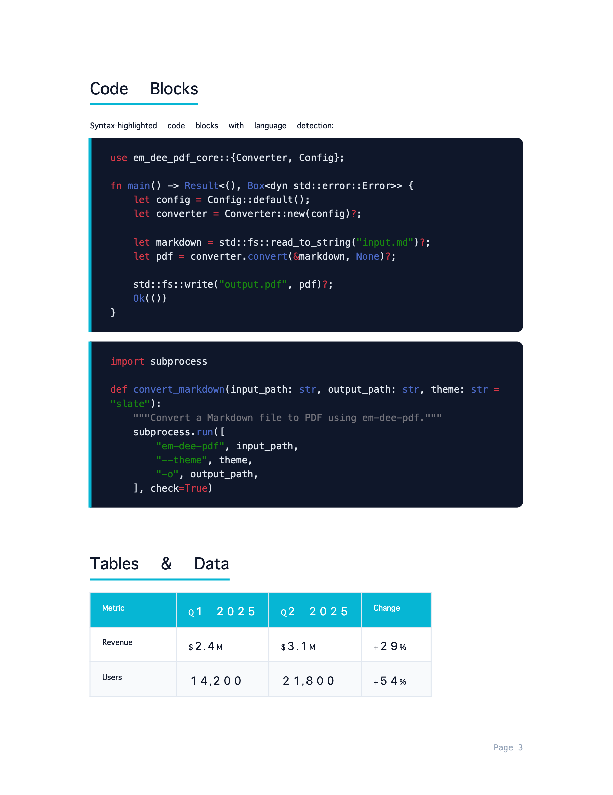
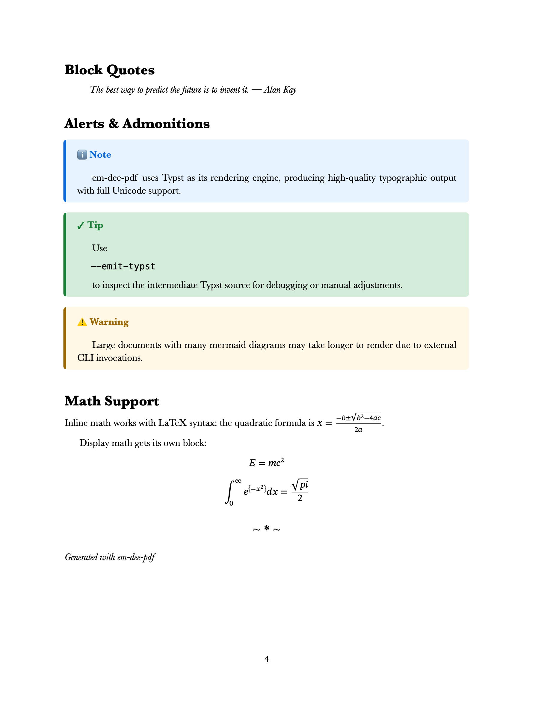
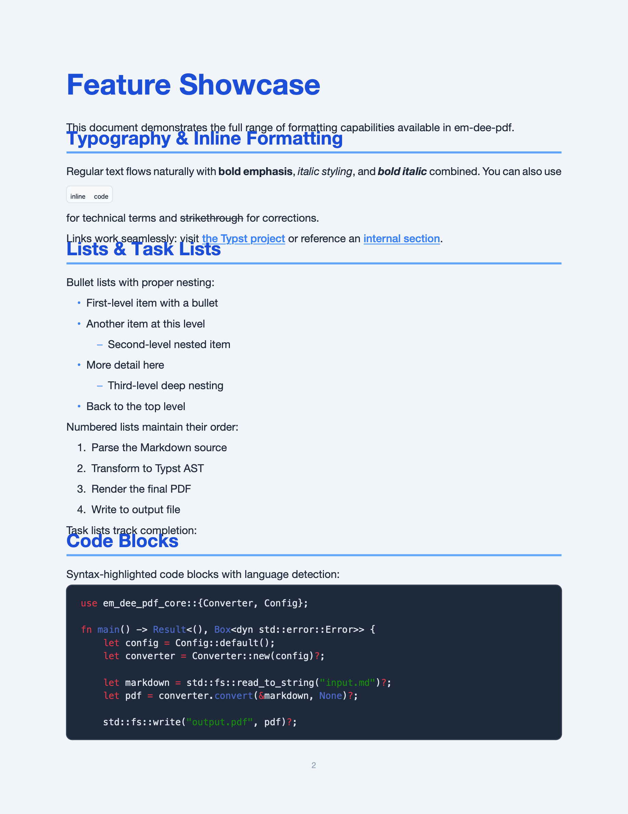
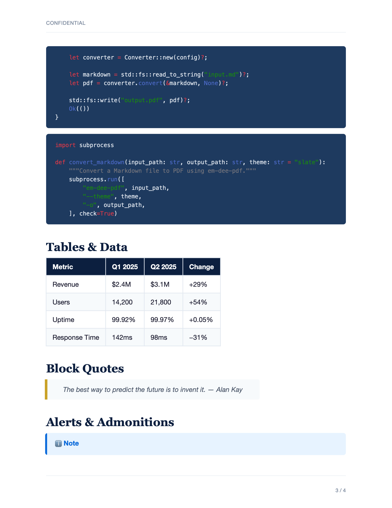

# em-dee-pdf

Rust CLI that converts Markdown files to beautiful PDFs using Typst as the rendering engine.

<p align="center">
  <a href="examples/screenshots/slate.png"></a>
  <a href="examples/screenshots/coral.png"></a>
  <a href="examples/screenshots/tech.png"></a>
  <a href="examples/screenshots/book.png"></a>
  <a href="examples/screenshots/cards.png"></a>
</p>

## What it does

em-dee-pdf transforms Markdown documents into styled PDFs. The conversion process follows this architecture:
Markdown -> comrak parser -> AST -> Typst transpiler -> Typst renderer -> PDF.

## Features

- **18 built-in themes** — from minimal to corporate, with container layouts for structured documents
- **Syntax-highlighted code blocks** — language-aware highlighting with monospace fonts across all themes
- **LaTeX math support** — inline `$E = mc^2$` and display-mode equations with full symbol coverage
- **Tables** — with optional column sorting (numeric or string, ascending or descending)
- **Alerts & admonitions** — GitHub-style `[!NOTE]`, `[!TIP]`, `[!WARNING]` callout blocks
- **Table of contents** — auto-generated with configurable depth
- **Front matter** — YAML metadata for title, author, date
- **Mermaid diagrams** — optional rendering via mermaid-cli
- **Stdin/stdout piping** — composable with other CLI tools
- **Custom themes** — pass any `.typ` file for full control over styling

## Quickstart

### Installation

Install from source:
```bash
cargo install --path crates/em-dee-pdf-cli
```

Or build the binary:
```bash
cargo build --release
# Binary at target/release/em-dee-pdf
```

### Usage Examples

```bash
# Basic conversion
em-dee-pdf document.md

# Choose a theme
em-dee-pdf document.md --theme coral

# Multiple files
em-dee-pdf chapter1.md chapter2.md

# Pipe from stdin
cat document.md | em-dee-pdf - -o output.pdf

# See the generated Typst source
em-dee-pdf document.md --emit-typst

# Use a container theme with sections
em-dee-pdf document.md --theme cards --sections

# Sort a table before rendering
em-dee-pdf report.md --sort-table "0:2:desc:num"
```

## CLI Reference

```
em-dee-pdf [OPTIONS] <INPUT>...

Arguments:
  <INPUT>...   Input Markdown file(s). Use '-' for stdin.

Options:
  -o, --output <OUTPUT>        Output file path. Defaults to input filename with .pdf extension.
  -t, --theme <THEME>          Theme name or path to custom .typ file [default: slate]
      --toc                    Generate table of contents
      --sections               Wrap H2 sections in visual containers (for container themes)
      --page-size <PAGE_SIZE>  Page size [default: us-letter]
      --emit-typst             Output Typst source instead of PDF
  -c, --config <CONFIG>        Configuration file path (TOML)
  -v, --verbose                Verbose output
  -q, --quiet                  Quiet mode
      --sort-table <SORT_SPEC> Sort table by column. Format: "table_index:column_index:asc|desc[:num|str]"
      --list-tables            List tables in the markdown (useful for finding indices)
      --mermaid                Enable mermaid diagram rendering (requires mermaid-cli)
  -h, --help                   Print help
  -V, --version                Print version
```

## Themes

The project includes 18 built-in themes:

- **Special**: corporate, tech, book, coral
- **Container**: cards, panels, boxed (use with --sections)
- **Neutral**: slate (default), zinc, stone
- **Colors**: emerald, teal, sky, indigo, violet, rose, amber, orange

Container themes wrap H2 sections in styled boxes when the `--sections` flag is used.
For custom themes, pass a path to a `.typ` file via the `--theme` option.

### Theme Gallery

<table>
<tr>
<td align="center"><strong>Slate</strong> — Table of Contents<br></td>
<td align="center"><strong>Coral</strong> — Typography & Lists<br></td>
</tr>
<tr>
<td align="center"><strong>Tech</strong> — Code & Tables<br></td>
<td align="center"><strong>Book</strong> — Alerts & Math<br></td>
</tr>
<tr>
<td align="center"><strong>Cards</strong> — Section Containers<br></td>
<td align="center"><strong>Corporate</strong> — Code & Data<br></td>
</tr>
</table>

Generate these samples yourself:

```bash
em-dee-pdf examples/showcase.md --theme slate --toc -o examples/showcase-slate.pdf
em-dee-pdf examples/showcase.md --theme coral --toc -o examples/showcase-coral.pdf
em-dee-pdf examples/showcase.md --theme tech --toc -o examples/showcase-tech.pdf
em-dee-pdf examples/showcase.md --theme book --toc -o examples/showcase-book.pdf
em-dee-pdf examples/showcase.md --theme cards --toc --sections -o examples/showcase-cards.pdf
em-dee-pdf examples/showcase.md --theme corporate --toc -o examples/showcase-corporate.pdf
```

## Configuration

Configure default behavior using a TOML file.

```toml
[theme]
name = "coral"

[output]
page_size = "us-letter"
toc = false
toc_depth = 3
page_numbers = true
section_containers = false

[fonts]
search_paths = []
# default_family = "Arial"
# monospace_family = "Fira Code"

[extensions]
tables = true
task_lists = true
strikethrough = true
footnotes = true
math = true
autolinks = true
superscript = true
description_lists = true
front_matter = true
syntax_highlighting = true
mermaid = false
```

## Math & LaTeX

em-dee-pdf supports LaTeX math syntax via Typst's math engine. Enable math in your config (`math = true`, on by default) or just use dollar signs in your Markdown:

**Inline math:** Wrap expressions in single dollar signs.

```markdown
The quadratic formula is $x = \frac{-b \pm \sqrt{b^2 - 4ac}}{2a}$.
```

**Display math:** Wrap expressions in double dollar signs for centered, block-level equations.

```markdown
$$
\int_0^\infty e^{-x^2} dx = \frac{\sqrt{\pi}}{2}
$$
```

Supported LaTeX features:
- Fractions (`\frac{a}{b}`), square roots (`\sqrt{x}`), superscripts and subscripts
- Greek letters (`\alpha`, `\beta`, `\pi`, `\omega`, etc.)
- Operators and symbols (`\pm`, `\times`, `\infty`, `\approx`, `\leq`, `\geq`)
- Integrals, summations, and limits with bounds
- Matrices and aligned equations

## Code Blocks

Fenced code blocks with language annotations get syntax highlighting across all themes:

````markdown
```rust
fn main() {
    println!("Hello, world!");
}
```
````

All 18 themes include monospace font stacks that fall back gracefully across platforms (JetBrains Mono, Fira Code, SF Mono, Menlo, Courier New). Code blocks use non-justified text for proper character alignment.

## Docker

Build the image:
```bash
./scripts/docker-build.sh
```

Run with Docker:
```bash
docker run --rm -v "$(pwd):/work" em-dee-pdf:latest input.md -o output.pdf
```

Or use the wrapper script:
```bash
./scripts/em-dee-pdf-docker input.md -o output.pdf
```

## Library Usage

The core conversion logic is available as a Rust library in the `em-dee-pdf-core` crate.

```rust
use em_dee_pdf_core::{Converter, Config};

let config = Config::default();
let converter = Converter::new(config)?;
let pdf_bytes = converter.convert("# Hello World")?;
std::fs::write("output.pdf", pdf_bytes)?;
```

## License

This project is licensed under either the MIT License or the Apache License, Version 2.0.
